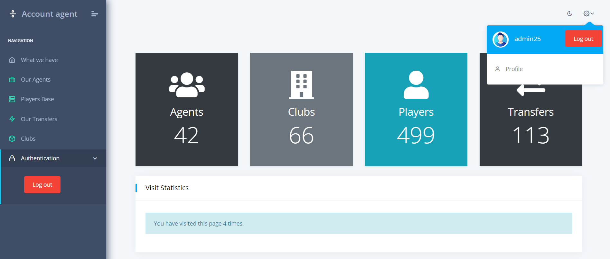

# Agent Service

Web application for football agents to view various information about players on the market, and about transactions made by other clubs and agents

## Check it out!

[Agent Manager App]()
<br>
(You would need to wait for ~1 minute for the server to wake up)

<i>If you don't want to register you can use the following credentials:</i>

* <i>Login: admin</i>
* <i>Password: admin2509</i>

## Installing locally / Getting started

Python3 must be already installed

```shell
git clone https://github.com/BohdanKuzik/agent-account.git
cd agent-account
python3 -m venv venv
pip install -r requirements.txt
python manage.py migrate
python manage.py generator_data
python manage.py runserver
```

After running that code you'll be able to browse the website locally on your computer.

### Features

* Authentication functionality for Agent/User
* Managing transfers and players from the presented interface
* Creating, deleting and editing different data
* Searching players in app
* Admin panel for advanced DB management

## Demo
